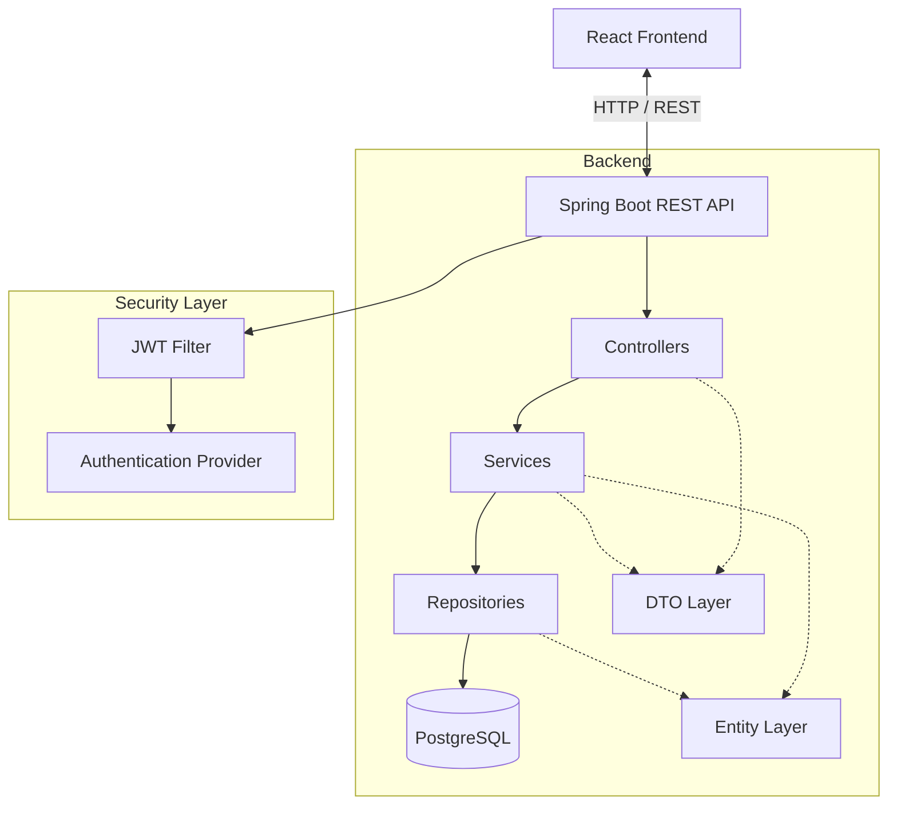
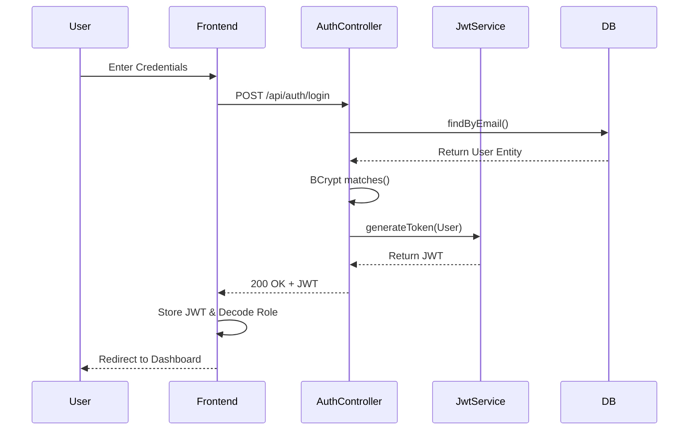
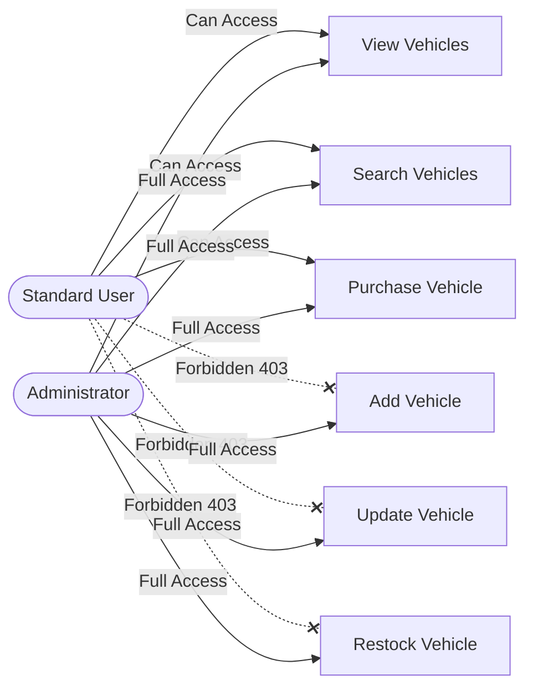
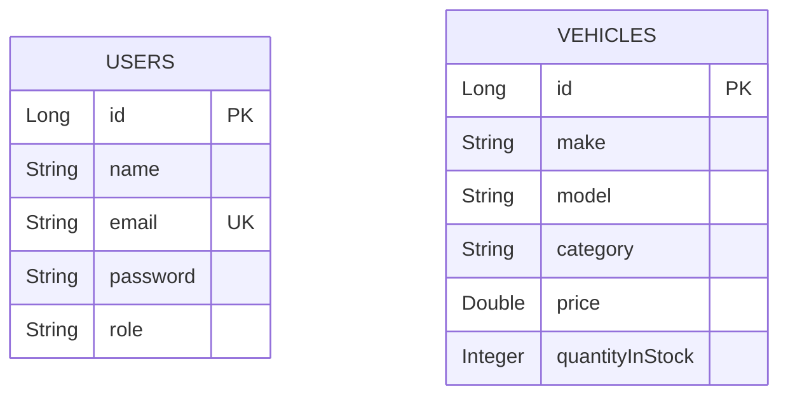

<div align="center">
  <br />
  <h1>🚗 Car Dealership Inventory System</h1>
  <p>
    <strong>A Premium, Full Stack Web Application for Managing Automotive Inventories</strong>
  </p>
  <p>
    <a href="#-tech-stack">Tech Stack</a> •
    <a href="#-features">Features</a> •
    <a href="#-api-documentation">API Docs</a> •
    <a href="#-installation--setup">Installation</a> •
    <a href="#-testing--tdd">Testing</a>
  </p>

  <p>
    
    
    
    
    
    
  </p>
  
  <p>
    
    
    
    
    
    
    
  </p>
</div>

---

## 📑 Table of Contents
<details>
<summary>Click to expand</summary>

- [Project Overview](#-project-overview)
- [Features](#-features)
- [Architecture & Flow Diagrams](#-architecture--flow-diagrams)
- [Folder Structure](#-folder-structure)
- [Tech Stack](#-tech-stack)
- [Installation & Setup](#-installation--setup)
- [API Documentation](#-api-documentation)
- [Authentication & Security](#-authentication--security)
- [Screenshots](#-screenshots)
- [Testing & TDD](#-testing--tdd)
- [My AI Usage](#-my-ai-usage)
- [Future Improvements](#-future-improvements)
- [Author](#-author)

</details>

---

## 📖 Project Overview

The **Car Dealership Inventory System** is a robust, enterprise-grade full-stack web application designed to streamline the management of automotive inventories. Built for scalability and security, the system empowers dealerships to effortlessly track vehicle stock, process purchases, and manage replenishments. 

The application utilizes a **Spring Boot** backend architected with a rigorous MVC pattern (Controller, Service, Repository, DTO, Entity), backed by a relational **PostgreSQL** database. Security is enforced through stateless **JWT Authentication** and strict **Role-Based Authorization**. The frontend is a modern, responsive **React** single-page application that dynamically adapts its interface depending on whether an `ADMIN` or a `USER` is logged in, ensuring a seamless and secure user experience.

---

## ✨ Features

### 🔐 Authentication & Security
- **Register & Login:** Secure user onboarding and authentication.
- **JWT Authentication:** Stateless security architecture using JSON Web Tokens.
- **BCrypt Encryption:** Industry-standard password hashing before persistence.
- **Role-Based Authorization:** Strict boundary enforcement between `ADMIN` and `USER` privileges across both UI and API.

### 🚗 Vehicle Management
- **Complete CRUD:** Admins can effortlessly Add, Update, and Delete vehicles.
- **View Inventory:** Users can browse the entire vehicle catalog or view granular details by ID.

### 🔍 Advanced Search
- **Dynamic Filtering:** Search vehicles by Make, Model, Category, and Price Range to rapidly find specific stock.

### 📦 Inventory Operations
- **Purchase Vehicle:** Users can securely purchase vehicles, decrementing available stock.
- **Restock Vehicle:** Admins can replenish inventory for specific vehicles.
- **Out of Stock Validation:** Prevents purchases of unavailable vehicles, maintaining data integrity.

### 🎨 Frontend Experience
- **Responsive UI:** Flawless experience across desktop, tablet, and mobile devices.
- **Modern Dashboard:** Comprehensive, visually appealing metrics overview.
- **Vehicle Cards & Details:** Elegant presentation of vehicle information.
- **Protected Routes & Dynamic Navigation:** Sidebar and routes instantly adapt based on the user's validated role.

---

## 🏗 Architecture & Flow Diagrams

### High-Level Architecture


### Authentication Flow


### Role-Based Authorization


### Database Flow


---

## 📁 Folder Structure

```text
car-dealership-inventory-system/
├── backend/
│   ├── src/main/java/com/yagnik/cardealership/
│   │   ├── auth/
│   │   │   ├── controller/
│   │   │   ├── dto/
│   │   │   ├── entity/
│   │   │   ├── exception/
│   │   │   ├── repository/
│   │   │   ├── security/     # JWT, Filters, Configs
│   │   │   └── service/
│   │   ├── common/
│   │   │   └── exception/    # GlobalExceptionHandler
│   │   └── vehicle/
│   │       ├── controller/
│   │       ├── dto/
│   │       ├── entity/
│   │       ├── exception/
│   │       ├── repository/
│   │       └── service/
│   └── pom.xml
└── frontend/
    ├── src/
    │   ├── components/       # Reusable UI components
    │   ├── context/          # AuthContext, ToastContext
    │   ├── hooks/            # Custom React Hooks
    │   ├── layouts/          # MainLayout, AuthLayout
    │   ├── pages/            # Dashboard, VehicleList, Login, etc.
    │   ├── services/         # Axios API clients
    │   ├── styles/           # Global CSS and Variables
    │   ├── utils/            # Formatters and Helpers
    │   ├── App.jsx           # Routing Configuration
    │   └── main.jsx
    └── package.json
```

---

## 💻 Tech Stack

| Category | Technology | Description |
| :--- | :--- | :--- |
| **Language** | Java 17 | Core backend programming language utilizing modern syntax features. |
| **Framework** | Spring Boot 3.x | Rapid application development framework for building the REST API. |
| **Security** | Spring Security | Robust access control framework handling authentication and authorization. |
| **Auth** | JWT | Stateless JSON Web Tokens for securely transmitting information. |
| **ORM** | Spring Data JPA | Simplifies database operations and eliminates boilerplate data access code. |
| **Database** | PostgreSQL | Highly reliable and extensible open-source relational database. |
| **Build Tool** | Maven | Dependency management and project build automation. |
| **Utilities** | Lombok | Reduces Java boilerplate code (getters, setters, constructors). |
| **Frontend Core**| React 18 | Declarative, component-based UI library. |
| **Routing** | React Router | Declarative routing for React single-page applications. |
| **HTTP Client**| Axios | Promise-based HTTP client for browser and node.js. |
| **Styling** | CSS Modules | Scoped styling to prevent CSS global namespace collisions. |

---

## 🚀 Installation & Setup

### Prerequisites
- **Java 17** installed
- **Node.js** (v18+) and **npm** installed
- **PostgreSQL** installed and running
- **Maven** installed (or use the provided wrapper)

### 🗄️ Database Setup
1. Open your PostgreSQL terminal (psql) or pgAdmin.
2. Create a new database:
```sql
CREATE DATABASE car_auth;
```
3. The tables will be automatically generated by Hibernate upon backend startup.

### ⚙️ Environment Variables
Create an `application.properties` in `backend/src/main/resources/` (if it doesn't exist) and configure your database credentials:
```properties
spring.application.name=car-dealership-inventory-system
server.port=8080

# PostgreSQL Configuration
spring.datasource.url=jdbc:postgresql://localhost:5432/car_auth
spring.datasource.username=postgres
spring.datasource.password=YOUR_PASSWORD
spring.datasource.driver-class-name=org.postgresql.Driver

# JPA / Hibernate
spring.jpa.hibernate.ddl-auto=update
spring.jpa.show-sql=true
spring.jpa.properties.hibernate.format_sql=true
```

### ☕ Backend Setup
1. Navigate to the backend directory:
```bash
cd backend
```
2. Build the project:
```bash
mvn clean compile
```
3. Run the Spring Boot application:
```bash
mvn spring-boot:run
```
The backend API will start at `http://localhost:8080`.

### ⚛️ Frontend Setup
1. Navigate to the frontend directory:
```bash
cd frontend
```
2. Install dependencies:
```bash
npm install
```
3. Start the development server:
```bash
npm run dev
```
The frontend will start on your configured Vite port (typically `http://localhost:5173` or `http://localhost:55774`). The API Base URL is dynamically mapped to `http://localhost:8080` in `src/services/api.js`.

#### Production Build
To create an optimized production build of the frontend:
```bash
npm run build
```

---

## 🌐 API Documentation

| Endpoint | Method | Description | Auth Required | Expected Role |
| :--- | :---: | :--- | :---: | :---: |
| `/api/auth/register` | `POST` | Register a new user | ❌ No | Any |
| `/api/auth/login` | `POST` | Authenticate and retrieve JWT | ❌ No | Any |
| `/api/vehicles` | `GET` | Retrieve all vehicles | ✅ Yes | `USER`, `ADMIN` |
| `/api/vehicles/{id}` | `GET` | Retrieve specific vehicle by ID | ✅ Yes | `USER`, `ADMIN` |
| `/api/vehicles/search` | `GET` | Search vehicles by parameters | ✅ Yes | `USER`, `ADMIN` |
| `/api/vehicles/{id}/purchase` | `POST` | Purchase 1 unit of vehicle | ✅ Yes | `USER`, `ADMIN` |
| `/api/vehicles` | `POST` | Add a new vehicle to inventory | ✅ Yes | `ADMIN` |
| `/api/vehicles/{id}` | `PUT` | Update an existing vehicle | ✅ Yes | `ADMIN` |
| `/api/vehicles/{id}` | `DELETE` | Remove a vehicle from inventory | ✅ Yes | `ADMIN` |
| `/api/vehicles/{id}/restock` | `POST` | Increase vehicle stock | ✅ Yes | `ADMIN` |

<details>
<summary><b>Example Login Request</b></summary>

```json
{
  "email": "admin@dealership.com",
  "password": "securepassword123"
}
```
</details>

<details>
<summary><b>Example Login Response</b></summary>

```json
{
  "message": "Login successful",
  "token": "eyJhbGciOiJIUzI1NiJ9.eyJyb2xlIjoiQURNSU4iLCJlbWFpbCI..."
}
```
</details>

### HTTP Status Codes
- `200 OK`: Request was successful.
- `201 Created`: Resource successfully created (Registration/Add Vehicle).
- `400 Bad Request`: Validation failure on DTO constraints.
- `401 Unauthorized`: Missing, expired, or invalid JWT token.
- `403 Forbidden`: Authenticated, but lacking the required Role (`USER` hitting an `ADMIN` endpoint).
- `404 Not Found`: Vehicle or Resource does not exist.
- `409 Conflict`: Business logic violation (e.g., Out of Stock, Email already exists).
- `500 Internal Server Error`: Unhandled backend exception.

---

## 🛡️ Authentication & Security

Security is deeply ingrained into the architecture to ensure robust protection against unauthorized access and privilege escalation.

1. **JWT Flow**: Upon successful authentication via `AuthController`, the `JwtService` issues a highly secure JWT signed with HMAC-SHA256. This token contains the user's `email` and their designated `role` as claims, minimizing the need for constant database queries.
2. **BCrypt Hashing**: All passwords are irreversibly hashed using BCrypt via the `PasswordEncoder` bean before being stored in PostgreSQL.
3. **Role-Based Access Control (RBAC)**: 
   - **Backend:** `SecurityConfig` and `JwtAuthenticationFilter` intercept all requests, load the `CustomUserDetails`, and explicitly check the route matchers against the granted `ROLE_ADMIN` or `ROLE_USER` authorities.
   - **Frontend:** The `AuthContext` seamlessly decodes the JWT upon login, extracting the role. A custom `ProtectedRoute` component wraps all sensitive `react-router-dom` routes, forcing redirects if unauthorized. Furthermore, Admin UI components (like the 'Add Vehicle' sidebar link or 'Edit'/'Delete' buttons) are completely stripped from the React Virtual DOM for standard users, removing even the visual possibility of interaction.
4. **Custom Exception Handling**: Filters dynamically route authentication failures to custom `AuthenticationEntryPoint` (401) and `AccessDeniedHandler` (403) handlers to return standardized, parseable JSON error objects matching the global `ApiError` format.

---

## 📸 Screenshots

| View | Screenshot |
| :--- | :--- |
| **Landing Page** |  |
| **Login** |  |
| **Register** |  |
| **Admin Dashboard** |  |
| **User Dashboard** |  |
| **Vehicle List (Inventory)** |  |
| **Vehicle Details** |  |
| **Add Vehicle** |  |
| **Update Vehicle** |  |
| **Delete Vehicle Modal**|  |
| **Search Functionality** |  |
| **Purchase Success** |  |
| **Restock Vehicle** |  |
| **Unauthorized / 404** |  |
| **Postman Collection** |  |
| **Test Report** |  |

---

## 🧪 Testing & TDD

The backend was strictly engineered following **Test Driven Development (TDD)** methodologies. The cycle of **Red ➔ Green ➔ Refactor** ensured that test coverage dictated the architecture, guaranteeing reliable and bug-free business logic.

- **JUnit 5 & Mockito**: Form the backbone of the testing suite. `Mockito` is utilized extensively to mock repositories and dependencies, ensuring complete isolation of the unit under test.
- **Service Tests**: Validate all core business rules independently. (e.g., verifying `VehicleOutOfStockException` is thrown appropriately during a purchase attempt).
- **Controller Tests**: Utilizing `@WebMvcTest` and `MockMvc` to guarantee HTTP endpoints serialize DTOs correctly and return the expected HTTP status codes.
- **Authentication & JWT Tests**: Rigorous tests validating token generation, expiration, signature validation, and correct 401/403 rejection mapping in the `SecurityConfig`.
- **Validation Tests**: Ensure Java Bean Validation annotations (like `@NotBlank` or `@Min`) function correctly on `VehicleRequest` and `RegisterRequest`.

### Running Tests
To execute the comprehensive test suite and view results:
```bash
cd backend
mvn test
```

---

## 🤖 My AI Usage

As part of the Incubytes Software Craftsperson Internship assignment requirements, below is the required disclosure regarding the utilization of AI tools in this project.

### Which AI Tools Were Used?
- **ChatGPT**
- **Antigravity AI**

### How Was AI Used?
AI acted as an interactive pair-programming companion, specifically utilized for:
- **Architecture Brainstorming**: Discussing the optimal separation of concerns between Controller, Service, and Repository layers.
- **Spring Security Debugging**: Assisting in resolving complex configuration issues surrounding the `SecurityFilterChain` and stateless filter implementation.
- **JWT Implementation Assistance**: Generating boilerplate for HMAC signing and claim extraction within the `JwtService`.
- **Unit Test Generation**: Providing scaffolding for repetitive Mockito setups, which were then manually tailored to the project's exact business rules.
- **Frontend Improvements**: Providing feedback on CSS Modules and React component organization to ensure a modern, polished aesthetic.
- **README & Refactoring**: Supplying formatting suggestions to ensure documentation meets open-source enterprise standards.

### Reflection & Verification
**Responsible AI Usage**: Every line of code suggested by the AI was deeply analyzed before integration. No code was blindly copy-pasted. 
**Human Verification**: All generated snippets were manually reviewed for security flaws (especially in the authentication layer), modified to fit the specific architecture constraints of this project, rigorously unit-tested via the TDD cycle, and verified functionally in the browser before being committed. This approach ensured that AI served as an accelerator for productivity rather than a crutch for core engineering knowledge.

---

## 🔮 Future Improvements

While the current system is robust and production-ready, there are several avenues for future enhancement:

- 🐳 **Dockerization**: Containerize both the Spring Boot backend and React frontend with a `docker-compose.yml` for unified, one-click environments.
- 🚀 **CI/CD Pipelines**: Implement GitHub Actions to automate Maven testing, ESLint checks, and deployment staging on every push.
- 📜 **Swagger / OpenAPI 3**: Integrate `springdoc-openapi` for interactive API exploration and client generation.
- 🔄 **Refresh Tokens**: Enhance JWT security by implementing short-lived access tokens combined with secure HttpOnly refresh tokens.
- 📑 **Pagination & Sorting**: Implement Spring Data Pageables on the `/api/vehicles` endpoint to handle massive inventory datasets efficiently.
- ☁️ **Cloud Deployment**: Deploy the database to AWS RDS, the backend to Elastic Beanstalk/Render, and the frontend to Vercel/Netlify.
- ✉️ **Email Verification & Password Reset**: Integrate Spring Mail to support secure account recovery flows.
- 📊 **Analytics Dashboard**: Introduce chart integrations (e.g., Recharts) to visualize sales velocity and inventory turnover rates on the Admin Dashboard.

---

## 👨‍💻 Author

**Yagnik Pansheriya**  
[](https://github.com/yagnik1505)  
*Software Engineer | Full Stack Developer*
